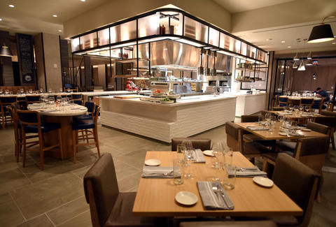
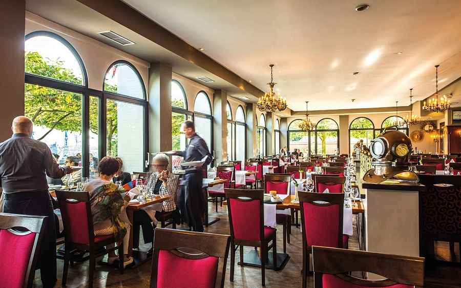

# Despre noi

Restaurantul nostru va sta la dispozitie oferindu-va o gama larga de servicii pentru toate ocaziile:
- Nunti
- Botezuri
- Majorate
- Petreceri Private
- Evenimente de Companie.

* Casa Hrisicos, in care a fost deschis la sfarsitul lunii iulie 2009 restaurantul, a fost construita in anul 1900 de catre Gheorge Hrisicos, negustor de vinuri si proprietarul mai multor imobile in Constanta. Situata in Piata Ovidiu din centrul vechi al orasului, aici a functionat un restaurant si un hotel, vizitat de numeroase personalitati ale Romaniei pana in Primul Razboi Mondial. Dupa razboi a fost cand sediu de hotel, cand de banca.
Lucrarile au fost facute cu o firma de restaurari de monumente. Fatada a fost refacuta dupa schitele vechi gasite cu imaginea cladirii, iar interiorul a fost amenajat in stil art nouveau. Totodata, cladirea a fost extinsa in partea din spate, astfel ca amprenta initiala la sol in forma de ”L” s-a transformat in dreptunghi.

* Va oferim garantia unei inalte calitati gastronomice si flexibilitate deplina in alcatuirea meniului, cat si adaptarea acestuia la bugetul dumneavoastra. 
Toate aceste servicii sunt furnizate de o echipa de profesionisti cu ani de experienta in acest domeniu.

* Punctele forte ale restaurantului sunt bucataria si meniul international, serviciile irepresabile si atmosfera unica.
Personalul restaurantului este pregatit sa se ingrijeasca pana si de cel mai mic detaliu. Atmosfera este speciala si datoria tavanului de sticla care permite luminii naturale sa rasfete fiecare colt al locatiei. Iar odata cu razelor sorelui te invitam si pe tine sa te rasfeti pe terasa noastra. Pentru confortul tau am avut grija sa existe si locuri de parcare, singura ta grija fiind relaxarea.

